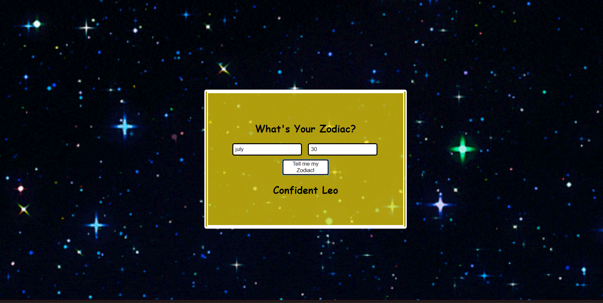

# Simple Horoscope Generator
When submitting your birth date and number your sun sign horoscope will pop up. Birthday data is not saved.

**Link to project:** https://hubberttaye.github.io/Horoscope/

## How It's Made:

**Tech used:** HMTL5, CSS3 and JavaScript

Really cool project to work on, simply because I like astrology. CSS was used to apply the layout, add a gif background and other special styling like border and font family. JavaScript controls which zodiac will appear based on the data entered and the color the box will be.

## Lessons Learned:

I learned how to use .style method for selecting DOM elements. Also learned that tag elements tend to have an array. Would like to simplify the JS sometime in the future.
